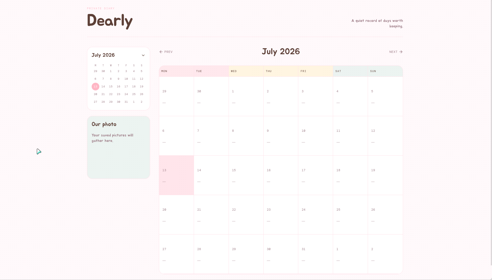
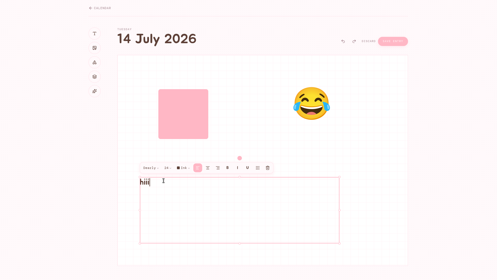
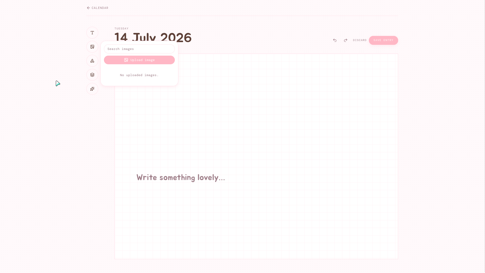
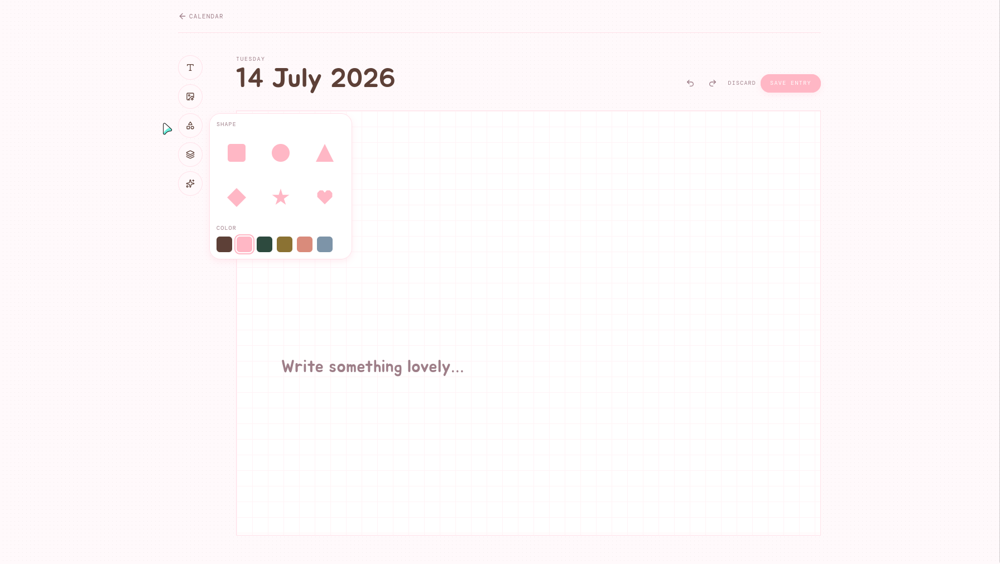
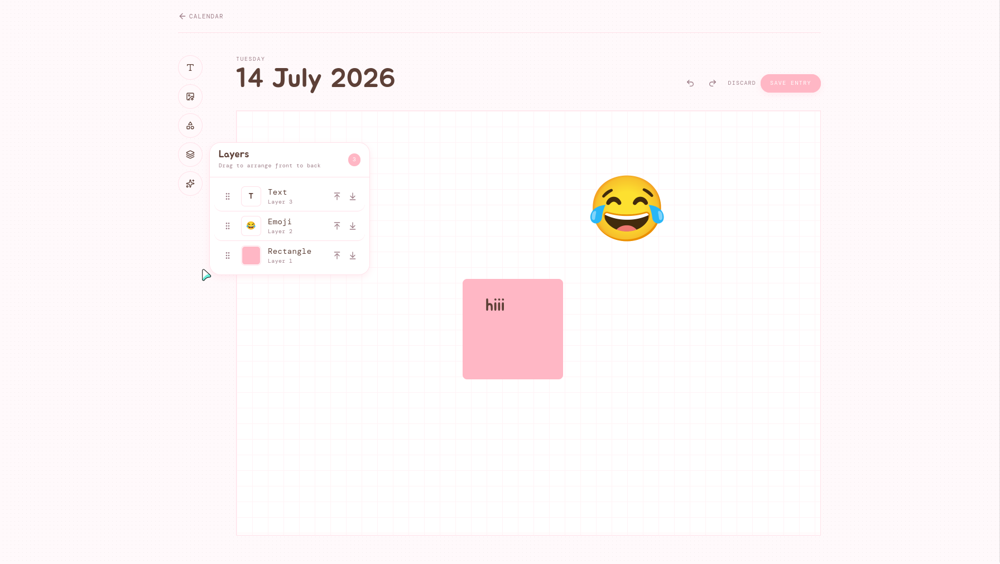
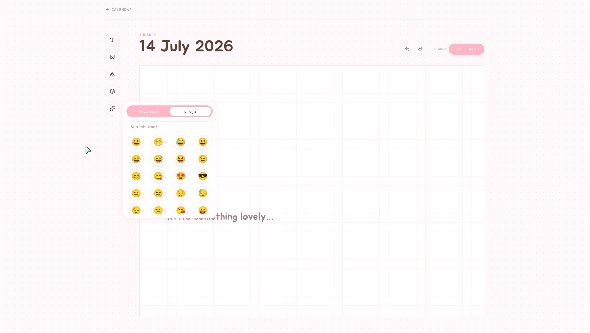
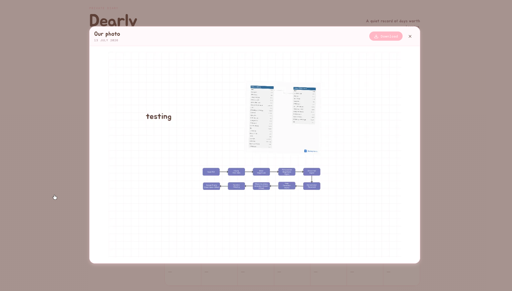

# Dearly

A private diary for composing dated memories on a freeform canvas.

See [DEPLOY.md](./DEPLOY.md) for deployment guide and required secrets.

## Screenshots

| Calendar                                     | Canvas toolbar                                           |
| -------------------------------------------- | -------------------------------------------------------- |
|  |  |

| Image picker                                         | Stickers & emoji                                         |
| ---------------------------------------------------- | -------------------------------------------------------- |
|  |  |

| Canvas layers                                                | Emoji picker                                         |
| ------------------------------------------------------------ | ---------------------------------------------------- |
|  |  |

| Photo preview                                          |
| ------------------------------------------------------ |
|  |

## Features

- Private daily diary with calendar navigation.
- Two calendars: the small sidebar calendar is for browsing photos, the large main calendar is for opening and editing entries.
- Shared spaces: invite people to your diary with a link, or join someone else's.
- Separate viewer and editor invite links, so reading and writing are handed out separately.
- Invite links ask before they act, naming the space, who invited you, and what the role can do.
- Switch between your own diary and any space shared with you; entries, photos, and stickers follow the space.
- Owners can see who joined and remove them; members can leave on their own.
- Freeform canvas for mixing text, images, stickers, emoji, and shapes.
- Rich text formatting with font, size, color, alignment, bold, italic, and underline.
- Layer ordering to control what sits in front or behind.
- Move, resize, rotate, and delete canvas elements.
- Canvas-wide Undo and Redo.
- Copy and paste text and images directly into the canvas.
- Local draft saving before final save.
- Photo preview modal with download from saved canvas snapshots.

## Stack

Cloudflare Workers, D1, R2, Effect, Foldkit, TypeScript, Bun, and Turbo.

## Local development

```bash
bun install
bun run dev
```

```bash
bun run check
bun run test
```
